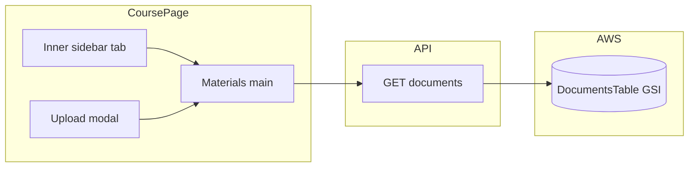

# Course documents list and CoursePage layout

## Backend

### IaC — `backend/template.yaml`

Add **`GetCourseDocumentsFunction`** after **`GenerateUploadUrlFunction`** (same structure as **`GetCoursesFunction`**):

| Property | Value |
|----------|--------|
| FunctionName | `limdocs-get-course-documents` |
| CodeUri | `src/` |
| Handler | `get_course_documents.lambda_handler` |
| Runtime | `python3.9` |
| Role | `!Sub "arn:aws:iam::${AWS::AccountId}:role/LabRole"` |
| Env | `DOCUMENTS_TABLE: !Ref DocumentsTable`, `INDEX_NAME: CourseIdIndex` |
| ApiEvent | `GET` `/courses/{courseId}/documents`, `RestApiId: !Ref LimdocsApi` |

Default API authorizer applies (`LimdocsAuth`).

**IAM:** LabRole must allow **`dynamodb:Query`** on `DocumentsTable` / index `CourseIdIndex` (and PutItem for uploads).

### Lambda — `backend/src/get_course_documents.py`

- `_CORS_HEADERS` / `_response()` pattern (same as other Lambdas).
- **`sub`** from `requestContext.authorizer.claims` → **401** if missing.
- **`courseId`** from `pathParameters` → **400** if missing.
- `Table.query` with `IndexName`, `KeyConditionExpression=Key("course_id").eq(course_id)`.
- **200** → `{ "documents": items }`.

Optional: verify course ownership before querying.

---

## Frontend service — `web/src/services/documentsService.js`

**`getCourseDocuments(courseId, idToken)`** — `GET` with Bearer token; return `data.documents` or `[]`.

---

## UI — `web/src/pages/CoursePage.jsx` and `CoursePage.css`

- Two-column **`course-page__body`**: inner sidebar + main; materials count from **`documents.length`**.
- **`activeTab`** (`materials`); fetch documents on load; refetch after upload.
- Materials header: title + Upload button; document cards with name, date, status badge.
- i18n under `coursePage` strings (tab, loading, errors, empty, aria labels).

### Premium minimalist CSS (CoursePage)

- **Body:** layout only on `--surface-page` — no outer card border/shadow on `course-page__body`.
- **Inner sidebar:** no gray panel; hairline `border-inline-end`; nav active state = soft tint + blue text (not primary button).
- **Cards:** white `#fff`, generous padding, shadow + hairline border; bold title; muted smaller date.
- **Badge:** soft pill (`#E8F4FF` / `#007AFF`), no harsh outline.
- **Header:** `space-between` alignment, margin below before list.

---

## Diagram

